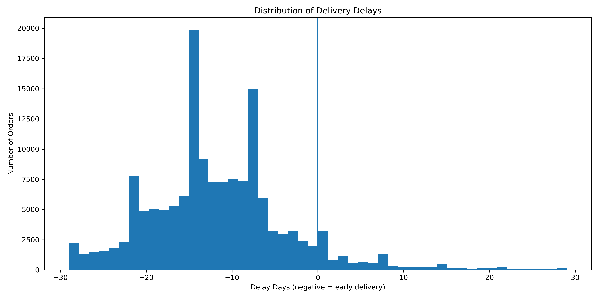
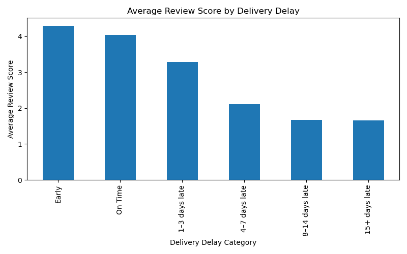
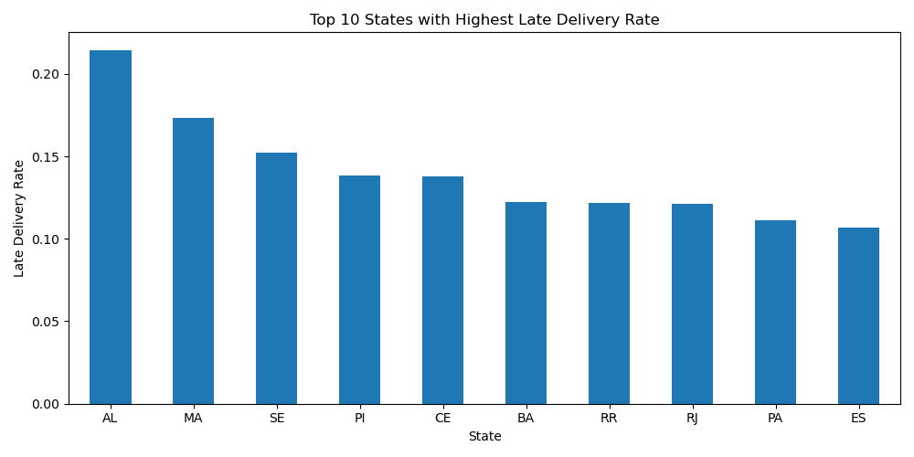
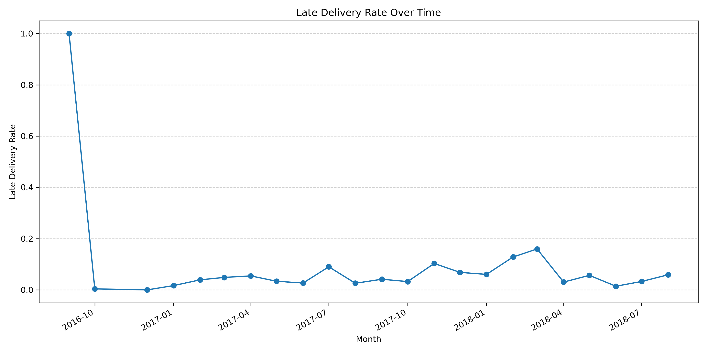
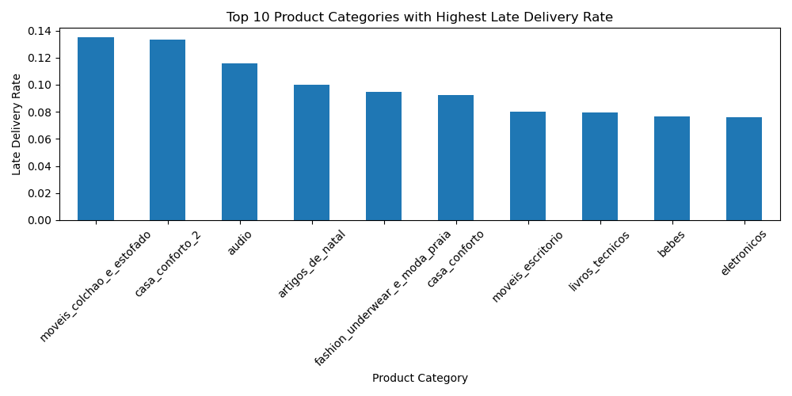
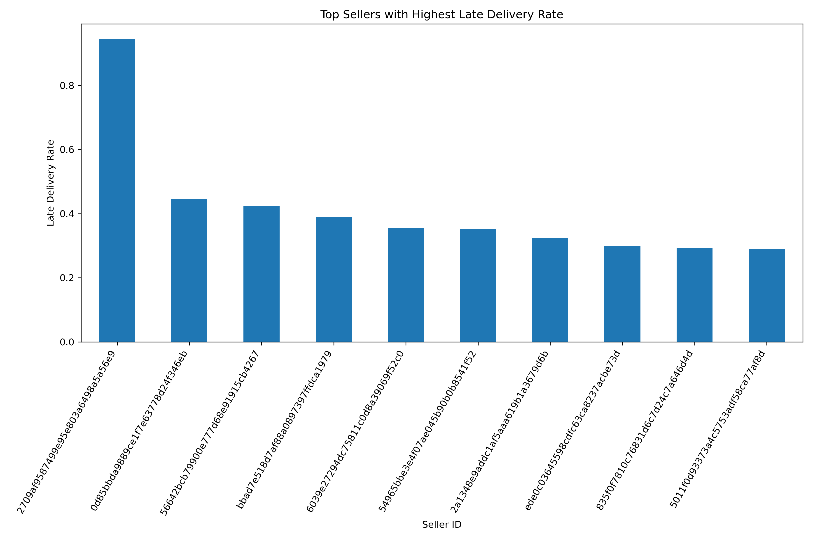

# Brazilian E-Commerce Delivery Performance Analysis

This project analyzes delivery performance in a Brazilian e-commerce marketplace using the Olist dataset. 

The objective is to examine how delivery delays affect customer satisfaction and to identify operational patterns behind late deliveries across regions, product categories, and sellers. 

Reliable delivery is a critical factor for customer experience in online marketplaces, and even small delays can significantly reduce customer ratings and overall marketplace trust.

---

## Business Questions

The analysis focuses on the following questions:

1. How often are orders delivered later than the estimated delivery date?
2. How do delivery delays affect customer review scores?
3. Which Brazilian states experience the highest late delivery rates?
4. Which product categories are more likely to be delivered late?
5. Are there specific sellers responsible for a large share of delays?

---

## Dataset

Dataset source: https://www.kaggle.com/datasets/olistbr/brazilian-ecommerce

The project uses the **Olist Brazilian E-Commerce Dataset**, a real dataset from a Brazilian online marketplace.

Main tables used in the analysis:

| Table | Description |
|------|-------------|
| orders | Order status and timestamps |
| customers | Customer identifiers and location |
| order_items | Products included in orders |
| payments | Payment information |
| reviews | Customer review scores |
| products | Product metadata and categories |
| sellers | Seller information |

These tables were merged into a single analytical dataset at the order level to track the delivery process from purchase to delivery.

---

## Data Preparation

The following preprocessing steps were performed:

- Converted timestamp columns to datetime format
- Filtered only delivered orders
- Calculated delivery duration metrics
- Created delay indicators
- Merged multiple relational tables into a single dataset

New features created:

| Feature | Description |
|--------|-------------|
| delivery_time_days | Actual delivery duration |
| estimated_delivery_days | Expected delivery duration |
| delay_days | Difference between estimated and actual delivery |
| is_late | Binary indicator showing whether the delivery was late |

---

## Methodology

The project follows a standard data analytics workflow:

### Data Cleaning
- Handling timestamps
- Filtering valid orders
- Removing inconsistent records

### Feature Engineering
- Delivery duration calculation
- Delay indicators
- Delivery delay categories

### Exploratory Data Analysis (EDA)
- Delay distribution
- Regional delay patterns
- Product category delays

### Visualization
- Delay vs review scores
- Late delivery rates by state
- Category delay patterns
- Seller performance analysis

---

## Key Findings

### Delivery Delays and Customer Satisfaction

Customer satisfaction decreases significantly when deliveries are late.

| Delay Category | Average Review Score |
|---------------|---------------------|
| Early | 4.29 |
| On Time | 4.03 |
| 1–3 days late | 3.29 |
| 4–7 days late | 2.10 |
| 8–14 days late | 1.68 |
| 15+ days late | 1.66 |

Even small delays can noticeably reduce customer ratings.

Key insights:

- Most deliveries arrive earlier than the estimated date
- Customer satisfaction drops sharply after delays exceed 3 days
- Some Brazilian states experience significantly higher delay rates
- A small number of sellers account for a large portion of delays

---

### Regional Differences

Some Brazilian states show significantly higher late delivery rates.

| State | Late Delivery Rate |
|------|--------------------|
| AL | 21.4% |
| MA | 17.3% |
| SE | 15.2% |
| PI | 13.8% |
| CE | 13.8% |

This may be related to logistics infrastructure, geographic distance, or transportation limitations.

---

### Product Categories with Higher Delay Risk

Certain product categories are more frequently associated with delivery delays:

- moveis_colchao_e_estofado
- casa_conforto_2
- audio
- artigos_de_natal
- fashion_underwear_e_moda_praia

Many of these items involve larger or more complex shipments.

---

### Seller Performance

The analysis shows that a small number of sellers account for a large share of delayed deliveries.

One seller in the dataset had a **94% late delivery rate across 469 orders**, suggesting major operational issues.

Monitoring seller performance could significantly improve marketplace logistics.

---

## Visualizations

### Delivery Delay Distribution



Distribution of delivery delays across all orders.

### Delay vs Customer Review Score



Customer satisfaction decreases significantly when deliveries are late.

### Late Delivery Rate by State



Some Brazilian states show significantly higher late delivery rates.

### Late Deliveries Over Time



Trend of late deliveries across the observed period.

### Product Categories with Higher Delay Risk



Certain product categories show higher delivery delay rates.

### Seller Delivery Performance



A small number of sellers account for a disproportionate number of delays.

---

## Technologies Used

- Python
- Pandas
- NumPy
- Matplotlib
- Jupyter Notebook

---

## Skills Demonstrated

- Data Cleaning and Preprocessing
- Feature Engineering
- Exploratory Data Analysis
- Data Visualization
- Business Insight Generation
- Working with relational datasets

---

## Conclusion

The analysis shows that delivery reliability strongly affects customer satisfaction in e-commerce platforms.

Key insights:

- Late deliveries significantly reduce review scores
- Some regions experience consistently higher delivery delays
- Certain product categories have higher logistical complexity
- A small number of sellers contribute disproportionately to delays

Improving logistics monitoring and identifying problematic sellers could significantly improve customer experience in online marketplaces.

---

## Business Recommendations

Based on the analysis, several actions could improve delivery performance:

- Monitor sellers with high delay rates and enforce delivery SLA policies
- Improve logistics partnerships in regions with the highest delay rates
- Adjust estimated delivery times for certain states to improve accuracy
- Improve handling and logistics for product categories with higher delay risk

---

## How to Run the Project

1. Clone the repository

```
git clone https://github.com/AdinaiMoldo/Brazilian-ecommerce-delivery-analysis.git
cd Brazilian-ecommerce-delivery-analysis
```

2. Install dependencies

```
pip install -r requirements.txt
```

3. Download the dataset from Kaggle and place it in the `data/` folder.

4. Run the notebook

```
jupyter notebook notebooks/Analysis_Brazilian_E_Commerce.ipynb
```
```